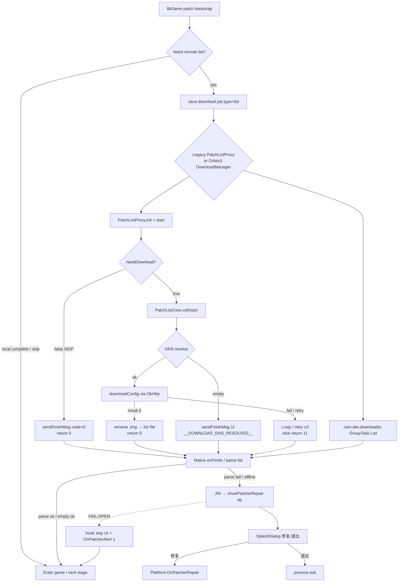

# Patch Latch Attack Map (static)

```yaml
updated: 2026-07-22T17:28:30+0800
track: race-static
device: none
libGame: $MXXY_WORK/runtime/native/libGame.so
jadx: $MXXY_WORK/jadx-core/sources + runtime/logs/jadx-facade-slice
ui_blocker: 解析下载列表出错… + 修复游戏/退出游戏
```

## 0. Verdict (for other tracks)

Observed offline gate UI is **native → Java repair dialog**, not the shapeconfig CDN wait.

- Tip text `解析下载列表出错…` is **not** a Java string constant and **not** plaintext in `libGame.so` (utf-8/gbk/utf-16 scanned = miss).
- UI surface that paints it: `MessiahNativeActivity.showPatcherRepair(String tip)` → `com.netease.messiah.SplashDialog.showPatcherRepair(tip)`.
- Buttons: layout-driven; repair click → `MessiahNativeActivity.onClickPatchRepair` → **`com.netease.messiah.Platform.OnPatcherRepair()`**.
- Confirm path on alert dialog → **`Platform.OnPatcherAlert(1)`** (cancel → `0`).

**Shortest fail-open (no CDN forgery):** suppress `showPatcher*` + force native continue via `OnPatcherAlert(1)` + short-circuit list download (`PatchListProxy.needDownload→false` / `start→0`).

---

## 1. State machine



### Result codes (Java download layer)

| Code | Constant / meaning | Exit kind |
|---|---|---|
| `0` | success / skip download | **success exit** |
| `11` | `Const.CODE_START_LISTFILE` default/fail; also used when params null | **fail → native parse error path** |
| `12` | network lost (`__DOWNLOAD_NETWORK_LOST__`) | fail |
| DNS marker filename | `__DOWNLOAD_DNS_RESOLVED__` with code 0/11 | intermediate |

### Success / skip exits (Java)

1. **`PatchListProxy.needDownload() == false`**  
   - params null → false  
   - file exists + md5 match (or md5=`NotMD5`) → false  
   - then `start()` → `sendFinishMsg(0, …)` + `return 0`  
2. **`PatchListCore.start()` downloadConfig returns 0** → rename `.tmp`, return 0 → Proxy `sendFinishMsg(0/iIntValue)`.
3. **Orbitv3 path**: `DownloadType.List` (`"list"`) via `DownloadProxy.downloadFunc/asyncDownloadArray` → `DownloadManager.process` → finish callback with code 0 (parallel stack; list I/O via `ListFileIo`).

### Fail exits that feed the UI latch

1. Airplane / no DNS → `PatchListCore` `sendFinishMsg(11, …, "__DOWNLOAD_DNS_RESOLVED__")` then return 11.
2. OkHttp / Lvsip exhaustion → return 11 → Proxy `sendFinishMsg(11, …)`.
3. `mDownloadParams == null` → `sendFinishMsg(11)` + return 11.
4. Native parse of missing/empty/corrupt list → **`showPatcherRepair("解析下载列表出错…")`** (string owned by native/script, not Java).

### Who parses the download list?

| Layer | Class / site | Role |
|---|---|---|
| Fetch (legacy) | `com.netease.download.list.PatchListCore` | HTTP GET list file; DNS+Lvsip; write path |
| Gate/skip (legacy) | `com.netease.download.list.PatchListProxy` | `needDownload` / `start` / finish notify |
| Fetch (orbitv3) | `com.dev.downloader.*` + `DownloadType.List` | Newer Orbit download stack |
| Notify | `DownloadListenerProxy$DownloadListenerHandler.sendFinishMsg` | JSON `{code,filename,filepath,…}` → listener → **native** |
| Parse / decide UI | **libGame.so** (native) | Interprets finish; on fail calls JNI showPatcher* |
| UI paint | `com.netease.game.MessiahNativeActivity.showPatcherRepair` | Posts `ShowPatcherRepairRunnable` |
| UI widget | `com.netease.messiah.SplashDialog.showPatcherRepair` | Actual repair screen |

> Note: No other Java file in jadx-core **imports** `PatchListProxy` (caller likely reflection / native-bridged / orbit path). Class still live in core DEX and was previously hooked at runtime.

### Who pops「解析下载列表出错」?

**Verified surface:** native →  
`MessiahNativeActivity.showPatcherRepair(String)` →  
`SplashDialog.showPatcherRepair(String)`.

Not from `PatchListProxy` log strings. Java only relays the tip.

---

## 2. Frida / smali signatures + suggested returns

### Call order (typical cold start, offline)

```
1. libGame patch bootstrap (construct patchlist url / decide list job)
2. Java download entry:
     DownloadProxy.downloadFunc / asyncDownloadArray
     OR PatchListProxy.init → start
3. PatchListProxy.needDownload
4. [if true] PatchListCore.call → start → DNS → downloadConfig
5. DownloadListenerHandler.sendFinishMsg(code, …)
6. native onFinish / parse
7. MessiahNativeActivity.showPatcherRepair(tip)     ← LATCH UI
8. user: onClickPatchRepair → Platform.OnPatcherRepair
   OR alert confirm → Platform.OnPatcherAlert(1)
```

### Hook table (copy into scripts)

| # | Frida target | Smali-ish signature | Suggested return / action |
|---|---|---|---|
| 1 | `com.netease.game.MessiahNativeActivity.showPatcherRepair` | `showPatcherRepair(Ljava/lang/String;)V` | **no-op**; then `Platform.OnPatcherAlert(1)` |
| 1b | `…showPatcherAlert` | `showPatcherAlert(Ljava/lang/String;Ljava/lang/String;)V` | no-op + `OnPatcherAlert(1)` |
| 1c | `…showPatcherHint` | `showPatcherHint(Ljava/lang/String;Ljava/lang/String;)V` | no-op |
| 2 | `com.netease.download.list.PatchListProxy.needDownload` | `needDownload()Z` | **`false`** |
| 2b | `…PatchListProxy.start` | `start()I` | **`0`**; optionally call original only if needed; ensure `sendFinishMsg(0,…)` if short-circuiting |
| 3 | `com.netease.messiah.Platform.OnPatcherAlert` | `OnPatcherAlert(I)V` **native** | Do **not** replace; **call** with `1` after suppressing UI |
| 3b | `com.netease.messiah.Platform.OnPatcherRepair` | `OnPatcherRepair()V` **native** | Optional: call after skip (repair path); prefer Alert(1) first |
| 4 | `com.netease.messiah.SplashDialog.showPatcherRepair` | `showPatcherRepair(Ljava/lang/String;)V` | no-op (belt) |
| 5 | `DownloadListenerProxy$DownloadListenerHandler.sendFinishMsg` | `sendFinishMsg(IJJLjava/lang/String;Ljava/lang/String;[BLjava/lang/String;Ljava/lang/String;)V` | Remap `code→0` when name/path contains `list` / `DOWNLOAD` / `patch` (**local signal only**, empty bytes OK) |
| 6 | `MessiahNativeActivity.onClickPatchRepair` | `onClickPatchRepair(Landroid/view/View;)V` | no-op or `OnPatcherAlert(1)` |

**Package gotcha (verified from facade imports):**

```text
com.netease.messiah.Platform
com.netease.messiah.SplashDialog
com.netease.game.MessiahNativeActivity
com.netease.download.list.PatchListProxy
com.netease.download.list.PatchListCore
```

Wrong: `com.netease.game.Platform` (prior fail-open miss).

### Recommended 3-step fail-open order

1. Hook **`showPatcherRepair/Alert/Hint`** → skip + `OnPatcherAlert(1)`  
2. Hook **`PatchListProxy.needDownload` → false** and **`start` → 0**  
3. Remap **`sendFinishMsg`** non-zero list/DNS markers → `0`  

Use **`Java.performNow`** (or attach-after-start). Spawn-only `Java.perform` often never arms before the latch.

---

## 3. libGame.so strings + xrefs (patch/download/list)

### Strings

| RVA (VA) | String | Notes |
|---|---|---|
| `0x4b2e4e8` | `your project patchlist url` | **Only** high-signal patchlist ASCII hit in libGame |
| — | Chinese tip | **absent** (not utf-8/gbk/utf-16le) — likely script/locale blob or built at runtime |

JNI method name strings `showPatcherRepair` / `OnPatcherAlert` also **absent** as plaintext (RegisterNatives / obfuscated names).

### ADRP+ADD xrefs → `0x4b2e4e8`

From `arm64_string_xrefs.py` → `patchlist-string-xrefs.json`:

| xref instruction RVA | ADD RVA | Dist | Patch candidacy |
|---|---|---|---|
| `0x1cb6784` | `0x1cb6788` | 1 | **High** — same 0x1cbxxxx band as URL path format `0x1cb53c0` |
| `0x1cb67a8` | `0x1cb67b0` | 2 | High |
| `0x1cb67fc` | `0x1cb6804` | 2 | High |
| `0x1cb77f0` | `0x1cb77f8` | 2 | Medium/High |

Nearby known (already verified elsewhere):

| RVA | Role |
|---|---|
| `0x1cb53c0` | MD5 → `xx/yyyy…` path format |
| `0x1cbb4e4` | dynamic resource URL assemble |

### Suggested native patch / hook RVAs (candidates only)

| Candidate | Suggested use | Strength |
|---|---|---|
| `libGame+0x1cb6784` | Hook entry that loads patchlist url string; force “no list needed” / skip download branch | partial (xref only) |
| `libGame+0x1cb67a8` | Same cluster | partial |
| `libGame+0x1cb67fc` | Same cluster | partial |
| `libGame+0x1cb77f0` | Secondary ref site | partial |
| JNI `showPatcherRepair` (via Java hook) | Prefer over blind native NOP | **verified** |

Do **not** claim a single “ret-true” native function until disassembly of these sites confirms branch semantics.

---

## 4. Forbidden / allowed

| Allowed | Forbidden |
|---|---|
| Skip list download; treat local base as complete | Forge HTTP 200 / CDN payloads |
| Suppress repair UI + `OnPatcherAlert(1)` | Probe third-party hosts |
| Remap local finish code 0 with empty bytes | Fake payment success |

---

## 5. Ready-to-use script

`$MXXY_WORK/runtime/logs/patch-failopen.js`

Device track: load this alone first (no heavy GL dumps) after privacy accept.
